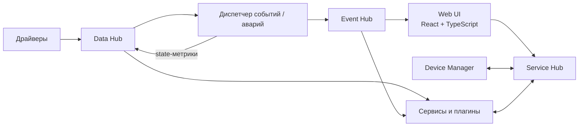

# Архитектура проекта «Диспетчер»

## Статус документа

Этот файл фиксирует **первый согласованный архитектурный baseline** проекта.

Он описывает общую модель backend, взаимодействие сервисов, runtime-модель метрик и уже подтверждённые технические решения. Документ намеренно не является детальным ТЗ: технологии фиксируются только тогда, когда они реально выбраны в соответствующем спринте. Поэтому часть решений уже конкретизирована для Data Hub, а Event Hub, Service Hub, БД, deployment и другие будущие механизмы пока остаются открытыми.

## Общий подход

Backend строится как набор логически независимых сервисов.

Основные принципы:

- крупная система не объединяется в единый монолит;
- сервисы не должны знать друг о друге без необходимости;
- основной обмен строится вокруг Hub-механизмов;
- сервис публикует данные и события, не зная заранее всех их потребителей;
- прямое взаимодействие используется только там, где действительно нужен запрос/ответ;
- плагины подключаются к тем же общим контрактам, что и сервисы ядра;
- контракты взаимодействия не должны зависеть от языка реализации конкретного сервиса.

Hub — архитектурная роль, а не заранее выбранная технология.

## Общая схема



Схема концептуальная и не задаёт конкретные сетевые протоколы или количество процессов.

## Data Hub

Data Hub — центральное runtime-пространство текущих значений метрик.

Он должен:

- принимать обновления метрик от драйверов и сервисов;
- хранить последнее актуальное значение каждой метрики;
- распространять изменения подписчикам;
- позволять новому подписчику получить актуальное текущее значение и затем дальнейшие изменения;
- хранить и распространять state-метрики тем же общим механизмом, что и остальные метрики;
- принимать запросы `WriteMetric` и передавать их текущему владельцу/провайдеру метрики.

Data Hub не понимает предметную область. Для него нет специальных понятий «вентилятор», «котёл», «камера» и т. п. Он работает с непрозрачными идентификаторами метрик, типизированными runtime-значениями и необходимыми транспортными метаданными. State-метрика для Data Hub является обычной метрикой.

Data Hub не определяет writable/read-only свойство метрики и не проверяет пользовательские права: эти данные и проверки относятся к другим сервисам платформы.

Data Hub является источником актуального runtime-состояния, но не описания устройства и не исторического архива.

В `CORE-001` для Data Hub зафиксированы:

- gRPC как внешний RPC/streaming транспорт;
- Protocol Buffers proto3;
- versioned package `dispatcher.data_hub.v1`;
- отдельный документ контракта [`data-hub-contract.md`](data-hub-contract.md).

## Device Manager

Device Manager является источником истины об устройствах и описании их метрик.

Он знает:

- какие устройства существуют;
- их идентификаторы;
- название, описание и расположение;
- какие метрики относятся к устройству;
- описание и настройки метрик;
- допускает ли метрика запись;
- другие необходимые метаданные устройства.

Device Manager не обязан хранить realtime-значения метрик: они находятся в Data Hub.

Устройство может быть виртуальным и объединять метрики из разных источников.

## Модель управления: записываемые метрики

В ядре не вводится отдельная универсальная сущность `Command`.

Устройство предоставляет метрики. Метрика может быть доступна только для чтения либо для чтения и записи.

Запись значения является универсальным механизмом управления.

Примеры:

- `Temperature` — чтение;
- `Setpoint` — чтение/запись;
- `FanEnabled` — чтение/запись;
- `Mode` — чтение/запись.

Такой подход не заставляет инженера заранее описывать искусственный список команд и не ограничивает будущие протоколы и оборудование моделью `Start/Stop/Reset`.

В `CORE-001` внешний `WriteMetric` маршрутизируется внутри Data Hub через `WriteRouter` к `MetricWriteProvider`. Этот C++ port является внутренней границей сервиса, а не межсервисным Driver Runtime API. Реальный языково-независимый путь от Data Hub до отдельного Driver Runtime будет определён в спринте Driver Runtime на основании его фактических требований.

## State-метрики

У каждой рабочей метрики имеется связанная метрика, содержащая её текущее состояние.

Концептуально:

```text
AHU01.Temperature       = 37.4
AHU01.Temperature.State = Alarm
```

Название и способ идентификации связанной state-метрики будут определены позже; важен сам принцип.

Для одной рабочей метрики используется одно актуальное состояние.

Примеры состояний: `Normal`, `Warning`, `Alarm`, `NoData`, `Maintenance`. Точный набор пока не считается окончательно утверждённым.

## Диспетчер событий / аварий

Диспетчер событий/аварий подписывается на те метрики, для которых настроено наблюдение.

Его задачи:

- анализировать настроенные условия;
- определять актуальный state метрики;
- при изменении состояния записывать соответствующую state-метрику обратно в Data Hub;
- формировать обычные события и аварии;
- передавать сформированные события в Event Hub.

Dashboard, мнемосхема или другой потребитель получают готовое актуальное состояние метрики и не должны повторно вычислять аварийную логику.

State метрики в Data Hub и жизненный цикл аварии в Event Hub являются разными моделями.

## Event Hub

Event Hub — отдельное пространство обмена для событий и аварий.

Через него распространяются:

- обычные события;
- предупреждения;
- аварии;
- изменения состояния аварий;
- значимые системные события;
- значимые действия пользователей, если они должны отображаться в диспетчере событий.

Event Hub отделён от Data Hub: поток realtime-значений метрик не является потоком событий.

## Service Hub

Service Hub используется там, где сервисам требуется адресное взаимодействие или запрос/ответ.

Пример: сервису при формировании пользовательского описания может понадобиться получить у Device Manager название или расположение устройства.

Через этот же контролируемый слой Web UI взаимодействует с backend.

Для пользовательских запросов должна выполняться проверка:

- личности пользователя;
- его прав;
- доступа к нужному проекту или объекту;
- права управления, если запрос изменяет записываемую метрику;
- режима управления, если он включён политикой системы.

Точная модель аутентификации, авторизации и внутреннего RPC будет определена позже.

## Основные потоки

### Обновление метрики

```text
Оборудование → Драйвер → Data Hub → подписчики
```

Data Hub сохраняет последнее актуальное значение.

### Изменение state

```text
Data Hub
  → Диспетчер событий / аварий
  → проверка условия
  → запись state-метрики в Data Hub
```

Если условие порождает событие или аварию:

```text
Диспетчер событий / аварий → Event Hub → Web UI / подписанные сервисы
```

### Запрос метаданных

```text
Сервис → Service Hub → Device Manager → Service Hub → Сервис
```

### Пользовательская запись

```text
Web UI
  → Service Hub
  → проверка доступа
  → запись управляемой метрики
  → Data Hub / соответствующий путь к драйверу
  → оборудование
```

Последняя часть маршрута уточняется при проектировании драйверов и транспорта записи.

## Языки и Web

### Backend

Основной backend ядра и основные сервисы разрабатываются на современном C++.

Текущий baseline, зафиксированный первым backend-сервисом:

- C++20;
- CMake 3.20+;
- Ninja как предпочтительный локальный generator;
- CTest для тестов;
- Linux как целевая backend-среда;
- WSL как локальная Linux-среда разработки на Windows.

Допускается использование существующих C++ библиотек и создание собственных библиотек проекта по реальной необходимости.

### Web frontend

Web-интерфейс разрабатывается на React + TypeScript.

Node.js используется как инструментальная среда frontend-разработки и сборки. Он не считается обязательным backend-сервисом платформы.

### Языковая независимость расширений

Хотя основной backend пишется на C++, межсервисные контракты не должны быть C++-специфичными.

Это оставляет возможность в будущем создавать внешние сервисы или плагины на других языках при соблюдении общих контрактов.

## Пока не определено

На текущем этапе сознательно не зафиксированы:

- конкретная технология Event Hub;
- конкретная технология Service Hub и его RPC-модель;
- БД и схема постоянного хранения;
- механизм восстановления runtime-состояния после перезапуска;
- точный набор state-значений;
- внешний межпроцессный путь регистрации write-provider/Driver Runtime;
- формат Driver Runtime API;
- аутентификация и токены;
- окончательные process/container/deployment-модели;
- frontend state manager и UI-библиотеки.

Транспорт и сериализация Data Hub, а также C++/build baseline больше не относятся к этому списку: они были подтверждены реализацией `CORE-001`.

Остальные вопросы фиксируются только после отдельного обсуждения и появления реальной необходимости.
