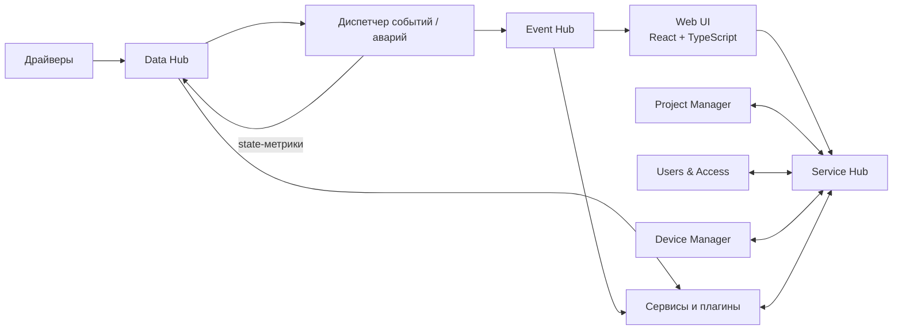

# Архитектура проекта «Диспетчер»

## Статус документа

Этот файл фиксирует **первый согласованный архитектурный baseline** проекта.

Он описывает общую модель backend, взаимодействие сервисов, runtime-модель метрик и уже подтверждённые технические решения. Документ намеренно не является детальным ТЗ: технологии фиксируются только тогда, когда они реально выбраны в соответствующем спринте. Решения уже конкретизированы для Data Hub, Service Hub, Project Manager и текущей Users & Access boundary, а Event Hub, общая persistence-стратегия будущих сервисов, deployment и другие будущие механизмы остаются открытыми до соответствующих спринтов.

## Общий подход

Backend строится как набор логически независимых сервисов.

Основные принципы:

- крупная система не объединяется в единый монолит;
- сервисы не должны знать друг о друге без необходимости;
- основной обмен строится вокруг Hub-механизмов;
- сервис публикует данные и события, не зная заранее всех их потребителей;
- прямое взаимодействие используется только там, где действительно нужен запрос/ответ;
- плагины подключаются к тем же общим контрактам, что и сервисы ядра;
- контракты взаимодействия не должны зависеть от языка реализации конкретного сервиса.

Hub — архитектурная роль, а не заранее выбранная технология.

## Общая схема



Схема концептуальная и не задаёт количество процессов.

## Data Hub

Data Hub — центральное runtime-пространство текущих значений метрик.

Он должен:

- принимать обновления метрик от драйверов и сервисов;
- хранить последнее актуальное значение каждой метрики;
- распространять изменения подписчикам;
- позволять новому подписчику получить актуальное текущее значение и затем дальнейшие изменения;
- хранить и распространять state-метрики тем же общим механизмом, что и остальные метрики;
- принимать запросы `WriteMetric` и передавать их текущему владельцу/провайдеру метрики.

Data Hub не понимает предметную область. Для него нет специальных понятий «вентилятор», «котёл», «камера» и т. п. Он работает с непрозрачными идентификаторами метрик, типизированными runtime-значениями и необходимыми транспортными метаданными. State-метрика для Data Hub является обычной метрикой.

Data Hub не определяет writable/read-only свойство метрики и не проверяет пользовательские права: эти данные и проверки относятся к другим сервисам платформы.

Data Hub является источником актуального runtime-состояния, но не описания устройства и не исторического архива.

В `CORE-001` для Data Hub зафиксированы:

- gRPC как внешний RPC/streaming транспорт;
- Protocol Buffers proto3;
- versioned package `dispatcher.data_hub.v1`;
- отдельный документ контракта [`data-hub-contract.md`](data-hub-contract.md).

## Device Manager

Device Manager является источником истины об устройствах и описании их метрик.

Он знает:

- какие устройства существуют;
- их идентификаторы;
- название, описание и расположение;
- какие метрики относятся к устройству;
- описание и настройки метрик;
- допускает ли метрика запись;
- другие необходимые метаданные устройства.

Device Manager не обязан хранить realtime-значения метрик: они находятся в Data Hub.

Устройство может быть виртуальным и объединять метрики из разных источников.

## Модель управления: записываемые метрики

В ядре не вводится отдельная универсальная сущность `Command`.

Устройство предоставляет метрики. Метрика может быть доступна только для чтения либо для чтения и записи.

Запись значения является универсальным механизмом управления.

Примеры:

- `Temperature` — чтение;
- `Setpoint` — чтение/запись;
- `FanEnabled` — чтение/запись;
- `Mode` — чтение/запись.

Такой подход не заставляет инженера заранее описывать искусственный список команд и не ограничивает будущие протоколы и оборудование моделью `Start/Stop/Reset`.

В `CORE-001` внешний `WriteMetric` маршрутизируется внутри Data Hub через `WriteRouter` к `MetricWriteProvider`. Этот C++ port является внутренней границей сервиса, а не межсервисным Driver Runtime API. Реальный языково-независимый путь от Data Hub до отдельного Driver Runtime будет определён в спринте Driver Runtime на основании его фактических требований.

## State-метрики

У каждой рабочей метрики имеется связанная метрика, содержащая её текущее состояние.

Концептуально:

```text
AHU01.Temperature       = 37.4
AHU01.Temperature.State = Alarm
```

Название и способ идентификации связанной state-метрики будут определены позже; важен сам принцип.

Для одной рабочей метрики используется одно актуальное состояние.

Примеры состояний: `Normal`, `Warning`, `Alarm`, `NoData`, `Maintenance`. Точный набор пока не считается окончательно утверждённым.

## Диспетчер событий / аварий

Диспетчер событий/аварий подписывается на те метрики, для которых настроено наблюдение.

Его задачи:

- анализировать настроенные условия;
- определять актуальный state метрики;
- при изменении состояния записывать соответствующую state-метрику обратно в Data Hub;
- формировать обычные события и аварии;
- передавать сформированные события в Event Hub.

Dashboard, мнемосхема или другой потребитель получают готовое актуальное состояние метрики и не должны повторно вычислять аварийную логику.

State метрики в Data Hub и жизненный цикл аварии в Event Hub являются разными моделями.

## Event Hub

Event Hub — отдельное пространство обмена для событий и аварий.

Через него распространяются:

- обычные события;
- предупреждения;
- аварии;
- изменения состояния аварий;
- значимые системные события;
- значимые действия пользователей, если они должны отображаться в диспетчере событий.

Event Hub отделён от Data Hub: поток realtime-значений метрик не является потоком событий.

## Service Hub

Service Hub используется там, где сервисам требуется адресное взаимодействие или запрос/ответ.

Пример: сервису при формировании пользовательского описания может понадобиться получить у Device Manager название или расположение устройства.

Через этот же контролируемый слой Web UI взаимодействует с backend.

В `CORE-002` для Service Hub зафиксированы и подтверждены реализацией:

- WebSocket как единый двусторонний транспорт для backend-клиентов, providers и Web Shell;
- UTF-8 JSON как формат сообщений;
- versioned WebSocket endpoint `/v1/ws`;
- WebSocket subprotocol `dispatcher.service-hub.v1`;
- отдельные роли client и provider connection;
- явная адресация `service` + `operation`;
- correlation через request ID;
- timeout и cancellation semantics;
- JSON Schema внешнего envelope-контракта;
- provider registration и удаление route при disconnect;
- параллельная correlation с Hub-scoped request IDs;
- `hub.unknown_service`, `hub.timeout`, `hub.cancelled` и `hub.provider_unavailable` как базовые runtime-ошибки;
- provider reconnect с повторной регистрацией service;
- прямая browser-compatible WebSocket boundary без обязательного отдельного gateway;
- самостоятельный Linux lifecycle с SIGINT/SIGTERM.

`CORE-005 / Step 4` совместимо расширил существующий Service Hub v1 request необязательным transport-level authentication context:

```json
{
  "auth": {
    "type": "session",
    "token": "64-lowercase-hex-characters"
  }
}
```

Service Hub проверяет только допустимую форму `auth` и переносит opaque credential provider отдельно от business `payload`. Hub не декодирует session token, не создаёт trusted `user_id`/roles/permissions и не принимает authorization decisions. Наличие синтаксически корректного `auth` само по себе не является доказательством действующей session.

Текущая C++ implementation использует Boost.Asio + Boost.Beast для WebSocket/networking и `json-c` для внутреннего JSON parsing/serialization. Эти библиотеки не являются частью межсервисного v1-контракта.

Подробный контракт: [`service-hub-contract.md`](service-hub-contract.md).

Service Hub маршрутизирует запрос по `service`, но не интерпретирует предметный смысл `operation` и `payload`. Схемы предметных payload принадлежат конкретным сервисам.

WebSocket выбран как единый транспорт, потому что provider должен иметь постоянный двусторонний канал для получения адресованных запросов, а Web Shell может использовать тот же протокол напрямую через стандартный browser WebSocket API без отдельного обязательного gateway.

Для защищённых пользовательских действий должна выполняться authoritative проверка:

- личности пользователя/session;
- его прав;
- доступа к нужному проекту или объекту;
- права управления, если запрос изменяет записываемую метрику;
- режима управления, если он включён политикой системы.

`CORE-002` изначально не реализовал эту безопасность. `CORE-005` добавляет её поверх уже стабильной Service Hub boundary: Step 3 зафиксировал server-side session model, Step 4 — transport auth propagation, Step 5 применил эту boundary к реальному Project Manager. Service Hub при этом не становится authorization engine.

## Project Manager

Project Manager — самостоятельный сервис проектов и их базового контекста.

В `CORE-004` зафиксированы:

- Project v1 со stable opaque `id`, `name`, `description`;
- плоская модель без parent project и без ownership будущих ресурсов;
- локальный SQLite schema v1 как durable storage, внутренний только для Project Manager;
- versioned Service Hub provider `project-manager.v1`;
- операции `create-project`, `list-projects`, `get-project`, `update-project`;
- Web-раздел `/projects` и shared frontend project context;
- browser → Service Hub → Project Manager → SQLite restart/re-registration integration.

`CORE-005 / Step 5` добавил backend-authoritative authorization поверх существующего `project-manager.v1`, не меняя Project entity и business payload. Все Project Manager v1 operations требуют session auth; `create-project` требует global `admin`, `list-projects` фильтруется по effective `view`, `get-project` требует project `view`, а `update-project` — project `edit` или `admin`. Project Manager выполняет authoritative evaluation через отдельное client-role соединение к `users-access.v1/evaluate-access` и при недоступности security dependency работает fail-closed. Frontend project context остаётся навигационным контекстом и не является доказательством доступа.

Подробный контракт: [`project-manager-contract.md`](project-manager-contract.md).

## Users & Access

Users & Access — самостоятельная backend responsibility для stable user identity, access configuration, authentication/session state и authoritative access evaluation.

В `CORE-005 / Steps 1–5` и текущем `Step 6A` уже зафиксированы:

- stable opaque user ID, независимый от login/display properties;
- enabled/disabled user state;
- независимые capabilities `view`, `control`, `edit`, `admin` без скрытой иерархии;
- named permission sets и assignments с global/project scope;
- effective permissions как union matching assignments;
- локальный SQLite durable storage только Users & Access;
- OpenSSL scrypt password verifier без plaintext storage;
- explicit secure first-admin bootstrap;
- opaque 256-bit server-side bearer session;
- 30-minute idle timeout и 12-hour absolute lifetime;
- хранение только SHA-256 session-token digest в SQLite;
- versioned service address `users-access.v1`;
- production provider через существующий Service Hub v1;
- public `login` и protected session-core operations `logout`, `current-session`, `evaluate-access`;
- Step 6A administration operations `list/create user`, enable/password reset, permission-set list/create и assignment list/add/remove;
- все administration operations требуют authoritative global `admin` и получают identity только из authenticated request context;
- create-user сохраняет user + scrypt credential atomically, а ordinary admin password baseline совпадает с bootstrap: 15..1024 bytes;
- authoritative validation bearer credential внутри Users & Access, а не в Service Hub;
- Project Manager authorization использует `users-access.v1/evaluate-access` и не читает Users & Access SQLite напрямую;
- local security audit baseline без записи password/raw session token; расширение audit taxonomy для новых admin mutations должно быть закрыто до CORE-005 acceptance.

В первом `CORE-005` реально поддерживаются только global и project scope. Device/Dashboard-specific ACL, external identity providers, MFA, произвольный ABAC и публикация audit events в будущий Event Hub намеренно не моделируются заранее.

Подробный контракт: [`users-access-contract.md`](users-access-contract.md).

## Основные потоки

### Обновление метрики

```text
Оборудование → Драйвер → Data Hub → подписчики
```

Data Hub сохраняет последнее актуальное значение.

### Изменение state

```text
Data Hub
  → Диспетчер событий / аварий
  → проверка условия
  → запись state-метрики в Data Hub
```

Если условие порождает событие или аварию:

```text
Диспетчер событий / аварий → Event Hub → Web UI / подписанные сервисы
```

### Запрос метаданных

```text
Сервис → Service Hub → Device Manager → Service Hub → Сервис
```

### Защищённый пользовательский request

```text
Web UI
  → Service Hub + opaque session auth
  → provider
  → authoritative Users & Access validation/evaluation
  → разрешённое service-specific действие или отказ
```

Service Hub переносит credential, но не определяет policy конкретного сервиса.

### Пользовательская запись

```text
Web UI
  → Service Hub
  → проверка доступа и control-mode policy
  → запись управляемой метрики
  → Data Hub / соответствующий путь к драйверу
  → оборудование
```

Последняя часть маршрута уточняется при проектировании драйверов и транспорта записи.

## Языки и Web

### Backend

Основной backend ядра и основные сервисы разрабатываются на современном C++.

Текущий baseline, зафиксированный первым backend-сервисом:

- C++20;
- CMake 3.20+;
- Ninja как предпочтительный локальный generator;
- CTest для тестов;
- Linux как целевая backend-среда;
- WSL как локальная Linux-среда разработки на Windows.

Допускается использование существующих C++ библиотек и создание собственных библиотек проекта по реальной необходимости.

### Web frontend

Web-интерфейс разрабатывается на React + TypeScript.

Node.js используется как инструментальная среда frontend-разработки и сборки. Он не считается обязательным backend-сервисом платформы.

### Языковая независимость расширений

Хотя основной backend пишется на C++, межсервисные контракты не должны быть C++-специфичными.

Это оставляет возможность в будущем создавать внешние сервисы или плагины на других языках при соблюдении общих контрактов.

## Пока не определено

На текущем этапе сознательно не зафиксированы:

- конкретная технология Event Hub;
- общая persistence-стратегия будущих сервисов и истории;
- механизм восстановления runtime-состояния Data Hub после перезапуска;
- точный набор state-значений;
- внешний межпроцессный путь регистрации write-provider/Driver Runtime;
- формат Driver Runtime API;
- browser-side session-token storage/restoration policy до `CORE-005 / Step 6B`;
- точная representation/expiration policy control mode до `CORE-005 / Step 7`;
- production TLS/origin policy для Service Hub;
- окончательные process/container/deployment-модели;
- frontend state manager и UI-библиотеки.

Транспорт и сериализация Data Hub и Service Hub, C++/build baseline, Project Manager local persistence, Users & Access local persistence/session representation и Service Hub session-auth transport больше не относятся к этому списку: они подтверждены соответствующими спринтами/шагами.

Остальные вопросы фиксируются только после отдельного обсуждения и появления реальной необходимости.
